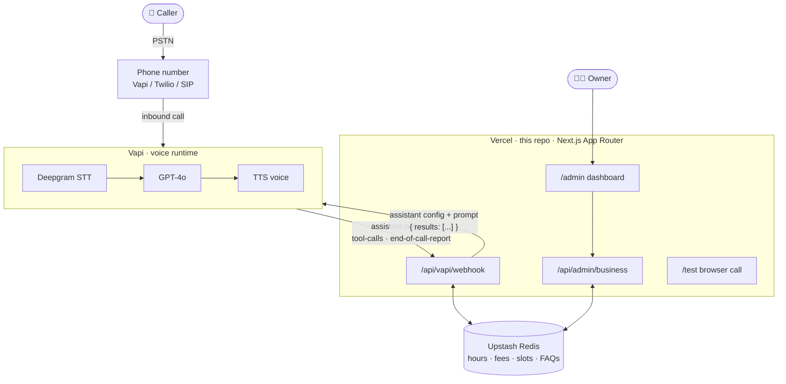
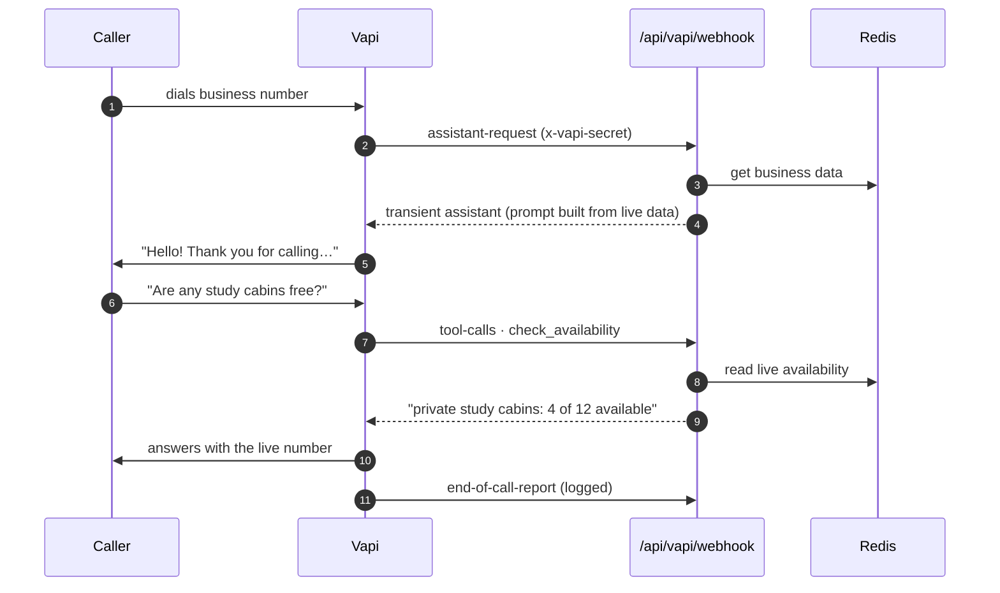

# 📞 Receptionist Agent

**An AI voice receptionist for local businesses.** Callers dial a normal phone number and a voice agent answers. It talks naturally and grounds every answer in live data that the owner edits from a web dashboard, with no redeploys.

[](https://github.com/Nihalfakhi-P/receptionist-agent/actions/workflows/ci.yml)


[](LICENSE)

## Features

- **Real phone calls.** Vapi handles telephony, speech-to-text (Deepgram Nova-3, multilingual), the LLM (GPT-4o) and text-to-speech in real time.
- **Fresh knowledge on every call.** The system prompt is rebuilt from live business data on each inbound call (`assistant-request`).
- **Live tool calls mid-conversation.** The agent calls `check_availability` instead of guessing seat or slot numbers.
- **Guardrailed prompt.** The agent may only state facts from the injected data. It declines off-topic questions, and it falls back to a human when it doesn't know.
- **Owner dashboard.** The owner edits hours, fees, availability, FAQs and announcements at `/admin`, and the next call uses the new data.
- **Browser test calls.** At `/test` you can talk to the exact same agent through your mic, with no phone number needed.
- **Business-agnostic.** A library, clinic, salon or gym is just different data, with no code changes.
- **Secure by default.** Webhook and admin endpoints fail closed, and secrets are compared in constant time.

## Architecture



**Why this design:** Vercel functions are stateless and short-lived, so they can't hold the long-lived WebSocket that a raw Twilio Media Streams voice bot needs. The latency-critical audio loop therefore runs on Vapi, and Vercel handles what it's good at: stateless webhooks and a dashboard. Fresh data is injected into the system prompt on **every call** (via `assistant-request`). Numbers that change during the day, like seat availability, are fetched **mid-call** through the `check_availability` tool.

### Call flow



## Project structure

```
app/
  api/vapi/webhook/route.ts    Vapi server events: assistant-request, tool-calls, reports
  api/admin/business/route.ts  Owner CRUD (Bearer ADMIN_TOKEN)
  api/test/assistant/route.ts  Assistant config for the browser test page
  admin/page.tsx               Owner dashboard
  test/page.tsx                Browser web-call test page
lib/
  business.ts                  Business-agnostic data schema + seed data
  prompt.ts                    System prompt builder (identity · voice style · knowledge · tools · guardrails)
  assistant.ts                 Full Vapi assistant definition
  tools.ts                     Pure tool-call resolver (unit-tested)
  auth.ts                      Constant-time, fail-closed auth helpers
  store.ts                     Upstash Redis store + validation
tests/                         Vitest unit tests
```

## Setup

### 1. Data store: Upstash Redis (free tier)

In the Vercel dashboard, go to **Storage → Marketplace → Upstash for Redis → Create** and link it to this project. Vercel injects `UPSTASH_REDIS_REST_URL` and `UPSTASH_REDIS_REST_TOKEN` automatically. Alternatively, create a database at console.upstash.com and set the two variables yourself.

### 2. Deploy to Vercel

```bash
npm i -g vercel
vercel link
vercel env add VAPI_WEBHOOK_SECRET   # long random string
vercel env add ADMIN_TOKEN           # long random string (owner's dashboard password)
vercel --prod
```

Note your production URL, for example `https://receptionist-agent.vercel.app`.

### 3. Vapi

1. Sign up at [dashboard.vapi.ai](https://dashboard.vapi.ai).
2. Add an OpenAI provider key (Settings → Provider Keys), or use Vapi's built-in one.
3. **Phone Numbers → Create**: get a free US number, or import a Twilio number.
4. On the number, set:
   - **Server URL**: `https://<your-app>.vercel.app/api/vapi/webhook`
   - **Server URL Secret**: the same value as `VAPI_WEBHOOK_SECRET`
   - Leave **Assistant** unassigned. That makes Vapi send `assistant-request` to the webhook, so the assistant is built with fresh data on every call.
5. Call the number.

### 4. Test without a phone (free, works from India)

Open `https://<your-app>.vercel.app/test` and paste your **Vapi public key** (Dashboard → Settings → API Keys) and the `ADMIN_TOKEN`. Click **Start test call** and talk to the agent through your mic. It uses the same assistant config, live data and tools as real phone calls.

### 5. Owner workflow

Open `https://<your-app>.vercel.app/admin`, enter the `ADMIN_TOKEN`, edit hours, fees, availability, FAQs or announcements, and click **Save**. The next call uses the new data, with no redeploy.

## Using an Indian (+91) number

TRAI regulations prevent Vapi and Twilio from provisioning Indian numbers directly. The options, from most to least practical:

1. **Call forwarding (fastest):** keep your existing +91 number and set unconditional call forwarding to your Vapi number. Callers still dial the number they know. International forwarding charges apply to the SIM plan.
2. **Indian SIP trunk:** get a virtual +91 number from an Indian cloud-telephony provider (Exotel, Plivo, Ozonetel and others) and connect it to Vapi via **SIP trunking** (Vapi: Phone Numbers → Import → SIP). This is compliant and production-grade, but the provider requires KYC paperwork.
3. **Test first with the free US number**, then set up option 2 when going live.

## Local development

```bash
npm install
cp .env.example .env.local   # set VAPI_WEBHOOK_SECRET and ADMIN_TOKEN (Redis optional locally)
npm run dev
```

To receive real Vapi webhooks locally, open a tunnel with `npx ngrok http 3000` and set the ngrok URL as the Server URL on the Vapi number.

### Quality checks

```bash
npm run typecheck   # tsc --noEmit
npm test            # vitest: auth, tool calls, validation, prompt guardrails
npm run build
```

CI runs all three on every push and pull request.

## Security

- `/api/vapi/webhook` rejects any request without the correct `x-vapi-secret` header. If `VAPI_WEBHOOK_SECRET` isn't set, it rejects everything.
- `/api/admin/*` and `/api/test/*` require `Authorization: Bearer <ADMIN_TOKEN>`. If the token isn't configured, they reject everything.
- Secrets are compared in constant time (`crypto.timingSafeEqual`).
- The browser test page receives the assistant config, which contains the webhook secret, only after admin auth.

## Adapting to another business

Everything the agent knows comes from `BusinessData` ([lib/business.ts](lib/business.ts)). To make it a salon, clinic or gym receptionist, edit the data in `/admin`: rename fees to prices, model chairs, courts or appointment slots as `resources`, and update the FAQs. The webhook, prompt builder and dashboard are all business-agnostic. The agent's persona is in [lib/prompt.ts](lib/prompt.ts) if you want a different name or tone.

## License

[MIT](LICENSE) © Nihal Fakhi
